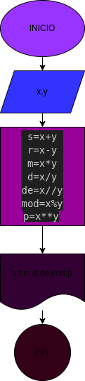

# EJERCICIO NO.3

progrma para calcular la suma, resta, multiplicacion, division, divicion entera, modulo y potencia de dos numeros 

## calcular mediante la suma, resta, multiplicacion, division, divicion entera, modulo y potencia de dos numeros 

# ANALISIS

variable de entrada (inpu)

x,y: numeros enteros ingresados 

Variable de proceso y salida 
(processing, storage, output)

s=x+y
r=x-y
m=x*y
d=x/y
de=x//y
mod=x%y
p=x**y

# DISEÑO

# CONSTRUCCION 